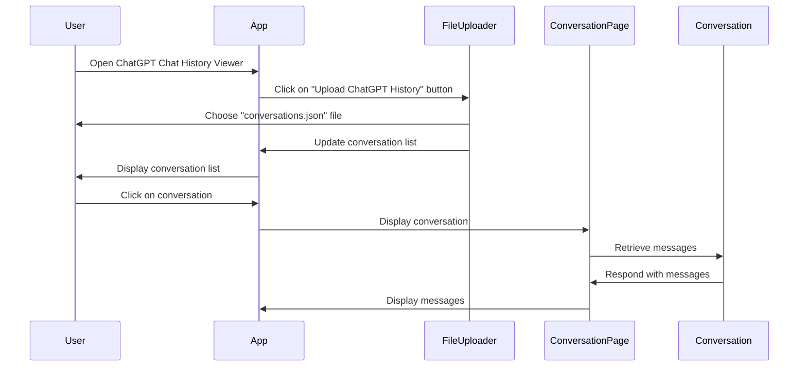

# ChatGPT History Viewer

This project is a ChatGPT chat history viewer that allows users to view their chat history offline. The application requires users to download their chat history from ChatGPT in the form of a `conversations.json` file, which can be found in the downloaded zip file.

## Installation

1. Clone the repository to your local machine
1. Run npm install to install all dependencies

## Usage

1. Run npm start to start the application
1. Click on the Upload ChatGPT History button and select your conversations.json file
1. Once uploaded, you will be taken to the Conversation List page, where you can see a list of all conversations
1. Click on a conversation to view its details on the Conversation Page

## Application Flow

## Step-by-Step Instructions

1. Open the ChatGPT website and log in to your account
1. Go to the Settings menu and select Download Chat History
1. Download the zip file and extract its contents to your local machine
1. Open the ChatGPT Chat History Viewer application
1. Click on the Upload ChatGPT History button
1. Select the conversations.json file from the extracted zip folder
1. Wait for the file to upload
1. Once uploaded, you will be taken to the Conversation List page, where you can see a list of all conversations
1. Click on a conversation to view its details on the Conversation Page
1. Use the navigation buttons to switch between conversations

## Features

- View all conversations
- View all messages in a conversation

## Contributing

Pull requests are welcome. For major changes, please open an issue first to discuss what you would like to change.

## License

This project is licensed under the MIT License - see the LICENSE.md file for details

## Acknowledgments

- [React](https://reactjs.org/)
- [React Router](https://reactrouter.com/)
- [ChatGPT](https://chat.openai.com/)