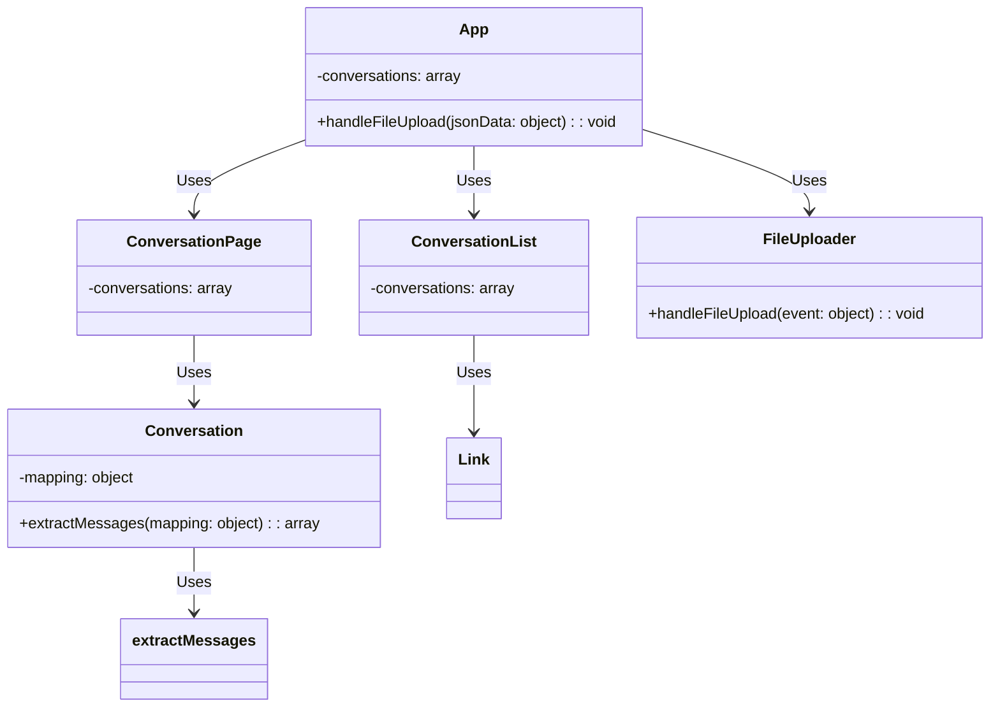

# ChatGPT Chat History Viewer Scripts

This repository contains the scripts for a ChatGPT Chat History Viewer, which is a web application that allows users to view their chat history offline. The application is built using React and React Router.

## App.js

This is the main component of the ChatGPT Chat History Viewer, and it handles the routing and rendering of the other components. It also contains the handleFileUpload function, which is used to update the state with the uploaded conversation data.

## ConversationList.js

This component is responsible for rendering the list of conversations. It uses the Link component from React Router to allow users to navigate to the conversation page.

## ConversationPage.js

This component is responsible for rendering the details of a single conversation. It retrieves the conversation data from the conversations prop and uses the useParams hook from React Router to get the conversation ID from the URL.

## FileUploader.js

This component is responsible for uploading the conversations.json file and parsing its contents. It uses the FileReader API to read the contents of the file, and the JSON.parse function to convert the contents into a JavaScript object.

## Conversation.js

This component is responsible for rendering the messages of a single conversation. It uses the extractMessages function from ../utils/extractMessages.js to extract the messages from the conversation data, and the ReactMarkdown component to render the message content as Markdown.

## extractMessages.js

This utility function is responsible for extracting the messages from the conversation data. It takes the conversation mapping object as input and returns an array of message objects, where each message object contains the content and sender properties.

## Conclusion

The scripts in this repository form a ChatGPT Chat History Viewer, which allows users to view their chat history offline. By using React and React Router, the application provides a seamless user experience, and the FileUploader component allows users to easily upload their chat history data.